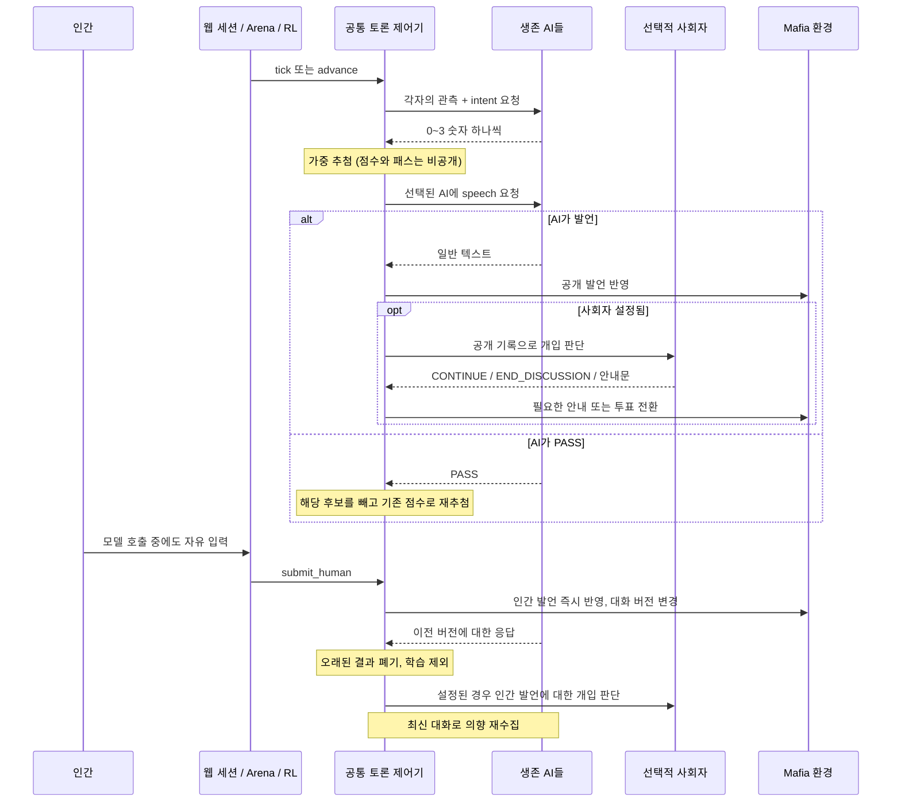

# 마피아 발언 의향 기반 토론

낮 토론은 모든 생존 AI가 발언 의향을 판단한 뒤, 그 점수에 따라 선택된 AI가 말하는 방식이다. 인간은 웹에서 토론 중 언제든 일반 텍스트를 보낸다. 밤 행동과 투표는 기존 순서대로 진행한다.

## 실행 흐름



- 의향: `0=듣기`, `1=기다려도 됨`, `2=말하고 싶음`, `3=지금 답변·반박하고 싶음`.
- 출력은 숫자 하나다. 이유나 별도 JSON을 요구하지 않는다. 점수는 질문·반박에 대한 모델 자신의 판단이다.
- 기본 추첨 가중치는 `0, 1, 4, 9`. 직전 발언자는 0.5배로 낮추며 재발언은 가능하다.
- 선택된 플레이어만 대사를 생성한다. `PASS`는 유효한 결정이며 공개 기록에 넣지 않는다.
- 제어 응답의 대소문자·따옴표·마침표 차이(`PASS.`, `CONTINUE.` 등)와 짧은 듣기 선언(`I'll listen for now. PASS.`)도 내부 명령으로 처리한다. 원문은 진단 기록에 남기지만 정확한 형식을 벗어난 응답은 학습에서 제외한다. 일반 문장에 명령어가 언급됐다는 이유만으로 발언을 숨기지는 않는다. 플레이어의 `CONTINUE`처럼 요청 종류에 맞지 않는 제어 명령은 공개하지 않고 오류로 처리한다.
- 모든 AI가 0 또는 모든 후보가 PASS이면 침묵으로 처리한다. 같은 관측을 반복 호출하지 않는다.
- 웹에서 생존 인간이 있으면 10초 입력을 기다린다. 이후 사회자가 하루에 한 번 토론을 유도하거나 끝낼 수 있다. 유도 뒤 다시 침묵하면 종료한다. 사회자가 없으면 투표로 넘어간다.
- 사회자는 플레이어 발언 뒤 판단하지만 매번 말하지 않는다. 자기 안내문에 대한 재귀 호출은 없다. 침묵 때 `CONTINUE`하면 새 정보 없이 반복하지 않고 토론을 종료한다.
- 하루 토론의 기본 상한은 플레이어 공개 발언 24개, 의향 수집 48회다. 웹은 실제 진행 시간 180초도 적용하며 일시정지는 제외한다. 사회자 안내는 플레이어 발언 수에 포함하지 않는다.

## 구현과 정보 경계

`Mafia`는 규칙과 메시지 반영만 담당한다. `MafiaDiscussionController`가 요청·추첨·사회자·제한을 제어한다. `Arena`와 `MafiaRolloutManager`가 같은 제어기를 사용한다.

| 인터페이스 | 역할 |
| --- | --- |
| `controller.tick()` | 짧은 비동기 작업 polling. 네트워크 완료를 기다리지 않음 |
| `controller.advance()` | 공개 상태가 한 번 바뀔 때까지 기다리는 Arena/RL용 어댑터 |
| `controller.submit_human(name, text)` | 토론 중 즉시 발언, 밤·투표는 현재 차례 검사 |
| `pause()`, `resume()`, `reset()`, `close()` | 시간 측정, 결과 무효화, 호출 자원 수명 관리 |
| `env.discussion_speak()`, `discussion_announce()`, `end_discussion()` | 환경의 공개 상태 변경 |
| `DecisionRequest` / `DecisionRecord` | 요청 종류·관측·세션·버전·결과·학습 가능 여부 |

플레이어에게는 `get_observation(player_name)`의 허용된 메시지만 전달한다. 사회자는 **`visible_to == "all"`만** 받는다. 기존 `get_observation("Moderator")`는 전지적 관측이므로 사회자 LLM에 사용하지 않는다.

의향, 선택 여부, PASS, 오류는 내부 기록이다. 공개 대화에는 실제 플레이어 발언과 사회자 안내만 추가한다. OpenAI 메시지는 발언자별로 분리하고 안정적인 `name`과 표시 이름을 붙인다. 다른 사람의 말을 현재 플레이어의 assistant 메시지에 합치지 않는다.

## 동시 실행과 실패

웹은 서버 측 `GameSession`에 게임과 worker를 두고 Gradio state에는 세션 ID만 보관한다. 화면은 0.5초마다 상태를 갱신한다. 인간 입력 callback은 모델 실행 큐를 기다리지 않는다. 공유 브라우저는 인간 좌석 하나를 지원하며, 인간 참여 시 다른 사람의 비밀 관측을 브라우저로 보내지 않는다. AI만 있는 게임은 전체 관전이 가능하다.

- API backend의 의향 요청은 최대 4개 worker로 병렬 실행한다. 동일 backend 인스턴스와 로컬 Transformers 호출은 gate로 보호한다.
- RL callback은 GPU 모델을 공유할 수 있으므로 단일 worker에서 직렬 실행한다. 선정 규칙과 관측은 동일하다.
- 상태 변경은 lock 안에서, 모델 호출은 lock 밖에서 실행한다.
- 세션 ID, 대화 버전, 제어 세대가 맞는 결과만 적용한다. 인간 발언·일시정지·재시작으로 무효화된 결과는 공개와 학습에서 제외한다.
- 한 제어기에는 한 batch만 진행된다. 오래된 batch가 끝나기 전 새 batch를 쌓지 않는다. 전체 프로세스에도 32개의 진행·대기 호출 슬롯을 두어 반복 재시작에 의한 호출 증가를 제한한다.
- 이미 시작한 동기 네트워크 호출의 취소는 보장하지 않는다. 호출 지연 동안에도 인간 입력과 화면 갱신은 가능하지만 새 AI 판단은 기존 호출이 끝날 때까지 기다릴 수 있다.
- 점수가 잘못되면 해당 AI만 한 번 재요청한다. 성공한 재시도는 선정에 사용할 수 있지만 학습에서는 제외한다. 전원 실패는 침묵이 아닌 오류다.
- 비어 있는 발언, backend 실패 신호, 사회자 오류도 오류 상태로 처리한다. 요청 batch의 기본 timeout은 60초다. 웹은 일시정지하고 RL은 미완료 에피소드로 기록한다.
- 새 시작은 새 환경을 만들며, Clear는 기존 세션을 닫는다. 30분 동안 조회되지 않은 세션은 worker를 종료한다.

## 설정과 실행

`examples/mafia.json`의 `environment`에 다음 옵션을 지정할 수 있다.

```json
{
  "env_type": "mafia",
  "max_days": 5,
  "max_discussion_messages": 24,
  "max_intent_rounds": 48,
  "discussion_seconds": 180,
  "silence_seconds": 10,
  "intent_weights": [0, 1, 4, 9],
  "repeat_speaker_factor": 0.5,
  "seed": 17,
  "discussion_moderator": null
}
```

`discussion_rounds`는 호환 로딩만 지원하고 경고 후 무시한다. 낮 토론 중 `get_next_player()`는 고정 차례가 없으므로 오류를 발생시킨다. 직접 환경을 순회하던 코드는 `Arena`나 공통 제어기를 사용해야 한다. 순서제 토론 모드는 없다. seed는 역할 배정과 선정 난수를 재현하지만 모델 생성 결과나 인간 입력 시간까지 고정하지는 않는다.

선택적 사회자 설정은 Player 설정과 같은 형태다.

```json
{
  "discussion_moderator": {
    "name": "Moderator",
    "role_desc": "Keep the discussion focused and move to voting when appropriate.",
    "backend": {
      "backend_type": "openai-chat",
      "model": "YOUR_MODEL_NAME",
      "temperature": 0.3,
      "max_tokens": 100
    }
  }
}
```

```bash
conda run --no-capture-output -n chatarena_37 python -u mafia_app.py
```

**마피아 전용 UI**는 `http://localhost:8081`에서 열린다. 포트를 바꾸려면 `--port 8082`를 추가한다. 기존 범용 UI는 `app.py`로 별도 유지한다.

- 참가자 수(3~10명), AI 모델, 직접 참여 여부를 설정하고 **게임 시작**을 누른다. 인간은 Player 1이며, 역할은 무작위로 배정된다.
- 직접 참여하면 자신의 역할·메시지만 보인다. 참여를 끄면 비밀 메시지의 수신자까지 표시하는 전체 관전 모드다.
- 진행자 LLM 체크박스를 켜면 **진행자 모델**과 **토론 진행 지침**이 나타난다. 기존 범용 UI의 종료 조건 입력은 없다.
- 토론 시간·최대 발언·침묵 대기·의향 수집 횟수·최대 일수·사망 시 역할 공개는 숫자와 체크박스로 설정한다. JSON 입력은 필요 없다.
- 상단에 현재 날짜·단계와 모델 호출 진행률·대기 시간이 표시된다. 밤·투표의 인간 입력은 자기 차례에만 활성화되고, 낮 토론에는 언제든 보낼 수 있다.
- **일시정지**, **계속하기**, **초기화**로 게임을 제어한다. 설정 변경은 초기화 후 새 게임에 적용된다.
- `--no-capture-output`과 `-u`는 서버 시작 로그가 터미널에서 바로 보이게 한다. 웹 서버 실행 중 프롬프트가 돌아오지 않는 것은 정상이다.

현재 검증 환경은 이름과 달리 Python **3.8.20**, Gradio **4.44.1**이다. CLI는 기존 명령 기반 진행을 유지하며 토론 중 실시간 인간 입력을 지원하지 않는다. API 사용에는 해당 backend의 키가 필요하다.

## RL: 말할지 결정하는 것까지 학습

각 궤적에는 `kind`, `session_id`, `version`, `score`, `selected`, `action_valid`, `retry`, `stale`, `trainable`을 기록한다.

- 정상 의향 출력은 0이나 미선택이어도 학습한다.
- 선택된 대사, 정상 PASS, 밤 행동, 투표도 학습한다.
- 사회자·오류·재시도·오래된 응답은 손실에서 제외한다.
- 보상은 승리 +1, 패배 -1, 무승부 0뿐이다. 참여 횟수나 높은 점수에 대한 보너스는 없다.
- 완료된 그룹의 팀 보상으로 advantage를 계산한다. 결정마다 응답 토큰의 평균 log-probability를 구하고, 플레이어의 유효한 결정들을 평균한 뒤 그룹 평균 손실로 갱신한다.
- 생성과 손실 모두 마지막 1536개의 프롬프트 토큰을 사용한다. 의향과 대사의 서로 다른 길이에 의해 가중치가 결정되지 않도록 토큰 평균을 사용한다.
- `max_total_steps`는 공개 상태 전환 횟수의 상한(기본 500)이다. 여기에 걸리거나 모델 오류가 나면 `truncated`이며 실제 무승부와 구분한다. 학습과 완료 게임 승률에서 제외한다. 유효한 완료 에피소드가 2개 미만인 그룹은 업데이트하지 않는다.

학습 스크립트는 그룹 보상을 정규화하는 policy gradient 구현이다. PPO clipping이나 reference-model KL까지 포함하는 구현은 아니다.

```bash
conda run -n chatarena_37 python training/train_mafia_rl.py \
  --dry_run --num_episodes 4 --group_size 2 \
  --max_discussion_messages 3 --seed 17 \
  --output_dir /tmp/mafia-intent-dry-run
```

실제 학습은 PyTorch·Transformers·PEFT가 설치된 환경에서 `--dry_run`을 제거한다. `episodes.jsonl`에는 승자·종료 사유·날짜별 토론 종료 사유와 의향 분포, 발언 비율, 패스 비율, 실패율이 기록된다. 모델마다 점수 기준이 다르거나 항상 3을 출력하는 전략이 생기는지 이 지표로 확인한다.

## 비용과 검증 범위

생존 AI가 N명일 때 대화 한 번에 의향 N회, 실제 발언 1회, 선택적 사회자 1회 호출이 필요하다. PASS와 오류 재시도에는 추가 호출이 생긴다. 의향 응답은 짧아도 매번 관측 입력 비용은 발생한다.

```bash
conda run -n chatarena_37 python -m unittest discover -s tests/unit -p 'test_mafia*.py'
```

mock 테스트는 비밀 관측 분리, 의향·추첨·패스·침묵, 사회자, 제한, 오류, 인간 끼어들기, 재시작, 웹 세션과 설정 보존, RL 학습 포함·제외를 검사한다. PyTorch가 있으면 작은 모델로 토큰 평균·프롬프트 마스킹과 gradient 업데이트도 검사한다. 실제 LLM의 자연스러운 응답과 장기 학습 효과는 별도 플레이 평가가 필요하다.
