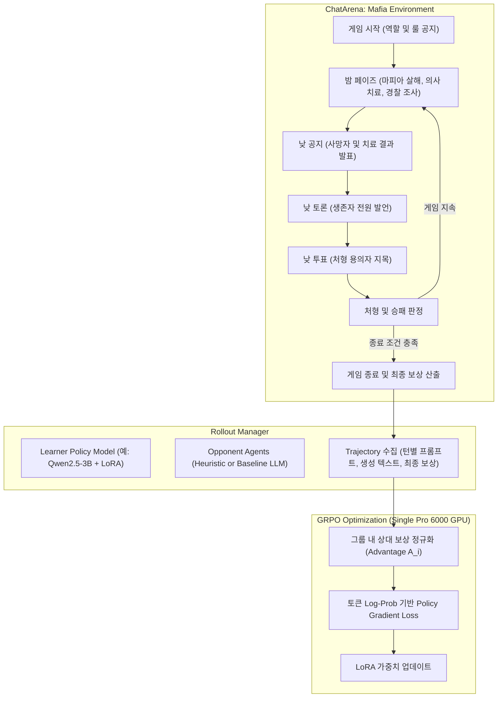
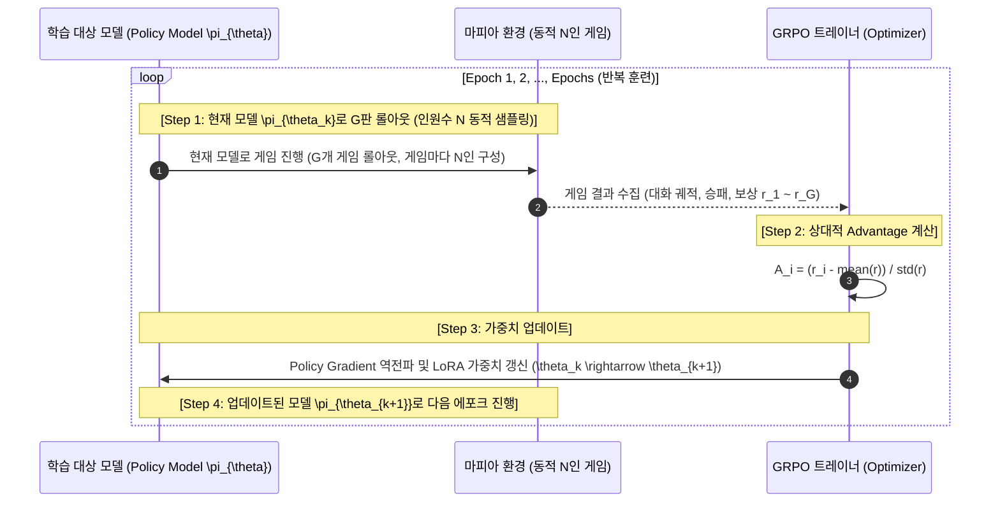

# Mafia Environment & LLM RL Training Pipeline Implementation Guide

이 문서는 **ChatArena** 프레임워크 내에 구현된 **마피아(Mafia/Werewolf) 멀티에이전트 게임 환경**의 세부 설계와, 단일 GPU(NVIDIA RTX Pro 6000 등)에서 오픈소스 LLM을 강화학습(RL)으로 훈련시키기 위한 **GRPO 기반 RL 학습 파이프라인 구현 계획 및 명세**를 정리한 문서입니다.

---

## 목차 (Table of Contents)

1. [전체 아키텍처 개요](#1-전체-아키텍처-개요)
2. [마피아 게임 환경 구현 명세 (Mafia Environment)](#2-마피아-게임-환경-구현-명세-mafia-environment)
   - [2.1 클래스 및 역할 정의](#21-클래스-및-역할-정의)
   - [2.2 설정 가능한 하이퍼파라미터](#22-설정-가능한-하이퍼파라미터)
   - [2.3 게임 턴 주기 및 상태 머신](#23-게임-턴-주기-및-상태-머신)
   - [2.4 비대칭 정보 가시성 (Observation Visibility)](#24-비대칭-정보-가시성-observation-visibility)
   - [2.5 자연어 행동 파싱 (Action Parsing)](#25-자연어-행동-파싱-action-parsing)
   - [2.6 승리 조건 및 기본 보상 체계](#26-승리-조건-및-기본-보상-체계)
3. [RL 학습 파이프라인 설계 및 구현 (RL Training Pipeline)](#3-rl-학습-파이프라인-설계-및-구현-rl-training-pipeline)
   - [3.1 다중 턴 언어 강화학습 문제 정의](#31-다중-턴-언어-강화학습-문제-정의)
   - [3.2 알고리즘 선정: 왜 GRPO인가?](#32-알고리즘-선정-왜-grpo인가)
   - [3.3 플레이어 수($N$)의 동적 조정 및 GRPO 그룹 크기($G$)의 개념 구분](#33-플레이어-수n의-동적-조정-및-grpo-그룹-크기g의-개념-구분)
   - [3.4 반복적 온폴리시(On-Policy) 롤아웃-학습 사이클 상세](#34-반복적-온폴리시on-policy-롤아웃-학습-사이클-상세)
   - [3.5 롤아웃 및 궤적 수집 (MafiaRolloutManager)](#35-롤아웃-및-궤적-수집-mafiarolloutmanager)
   - [3.6 보상 셰이핑 (Reward Shaping)](#36-보상-셰이핑-reward-shaping)
   - [3.7 단일 GPU(Pro 6000) 학습 아키텍처 & LoRA](#37-단일-gpupro-6000-학습-아키텍처--lora)
4. [사용 및 실행 가이드 (Usage Guide)](#4-사용-및-실행-가이드-usage-guide)
   - [4.1 단위 테스트 실행](#41-단위-테스트-실행)
   - [4.2 Web UI (Gradio) 시뮬레이션](#42-web-ui-gradio-시뮬레이션)
   - [4.3 GPU 머신에서의 RL 학습 실행](#43-gpu-머신에서의-rl-학습-실행)

---

## 1. 전체 아키텍처 개요

마피아 게임은 불완전 정보(Imperfect Information), 기만(Deception), 사회적 추론(Social Deduction)이 결합된 복잡한 멀티에이전트 게임입니다. 본 프로젝트는 **규칙 기반 환경(ChatArena Environment)**과 **언어 생성형 강화학습(Language RL)**을 결합하여 에이전트가 게임을 통해 전략적 발언과 투표 행동을 자율적으로 학습하도록 설계되었습니다.



---

## 2. 마피아 게임 환경 구현 명세 (Mafia Environment)

* 파일 위치: [`chatarena/environments/mafia.py`](file:///Users/choeseung-u/programming/ChatArena/chatarena/environments/mafia.py)
* 등록 식별자: `@register_env("mafia")`

### 2.1 클래스 및 역할 정의

기본적으로 4가지 역할이 정의되어 있습니다:

| 역할 (Role) | 팀 | 주요 행동 및 능력 |
| :--- | :--- | :--- |
| **`mafia`** | 마피아 팀 | 밤마다 시민 중 한 명을 살해 대상으로 지목. 낮에는 시민인 척 위장하여 투표에서 살아남음. |
| **`doctor`** | 시민 팀 | 밤마다 한 명을 선택하여 마피아의 공격으로부터 보호(치료). |
| **`police`** | 시민 팀 | 밤마다 한 명을 조사하여 해당 플레이어가 마피아인지 여부를 판별. |
| **`villager`** | 시민 팀 | 특별한 밤 능력이 없으며, 낮 토론과 단서 수집, 투표를 통해 마피아를 색출. |

### 2.2 설정 가능한 하이퍼파라미터

환경 초기화 시 인원 수와 직업 구성을 유연하게 조정할 수 있습니다:

```python
env = Mafia(
    player_names=["Player 1", "Player 2", "Player 3", "Player 4"],
    role_counts={"mafia": 1, "doctor": 1, "police": 1, "villager": 1}, # 직업별 인원 수
    role_mapping=None,         # 특정 플레이어에게 직업을 직접 고정 지정할 때 사용
    role_descriptions=None,    # 직업별 커스텀 프롬프트 설명
    discussion_rounds=1,       # 낮 토론 시 생존 플레이어당 발언 기회 수
    max_days=5,                # 최대 게임 진행 일수 (초과 시 무승부)
    reveal_role_on_death=True, # 처형 또는 사망 시 직업을 전체 공개할지 여부
)
```

### 2.3 게임 턴 주기 및 상태 머신

환경은 다음 순서로 페이즈(Phase)를 전환하며 진행됩니다:

1. **`reset()` 단계**:
   - 플레이어에게 역할을 배정하고, 전체 참가자 수와 직업 구성을 공개 방송(`visible_to="all"`).
   - 각 플레이어에게만 자신의 비밀 직업과 목표를 귓속말로 전달(`visible_to=[player_name]`).
2. **`NIGHT_MAFIA`**:
   - 살아있는 마피아 플레이어가 살해 대상을 지목. 마피아 발언은 마피아 팀원에게만 공개.
3. **`NIGHT_DOCTOR`**:
   - 살아있는 의사가 치료할 대상을 지목. 의사 발언은 본인에게만 공개.
4. **`NIGHT_POLICE`**:
   - 살아있는 경찰이 조사할 대상을 지목. 조사 결과(`"Player X is MAFIA / NOT MAFIA"`)를 사회자가 경찰에게 비공개로 즉시 회신.
5. **`DAY_ANNOUNCEMENT`**:
   - 밤사이 사망자 발표 (의사가 살해 대상을 맞혀 치료한 경우 "아무도 사망하지 않았습니다" 발표).
   - 사망자는 즉시 `alive_players`에서 제외.
6. **`DAY_DISCUSSION`**:
   - 생존한 모든 플레이어가 순서대로 돌아가며 자유 토론 진행 (전체 공개).
7. **`DAY_VOTING`**:
   - 생존한 플레이어들이 처형할 용의자를 1명씩 투표 (`"I vote to eliminate Player X"`).
8. **`DAY_ELIMINATION`**:
   - 투표 집계 후 최다 득표자 처형 (동점일 경우 아무도 처형되지 않음).
   - 승리 조건을 만족하지 못하면 `day += 1` 후 다음 밤 페이즈로 전환.

### 2.4 비대칭 정보 가시성 (Observation Visibility)

ChatArena의 [`MessagePool`](file:///Users/choeseung-u/programming/ChatArena/chatarena/message.py)과 `visible_to` 속성을 통해 철저한 정보 은닉을 구현했습니다:

* **전체 공개 메시지 (`visible_to="all"`)**:
  - 사회자의 게임 시작 공지, 아침 사망자 공지, 낮 토론 대화, 낮 투표 결과 발표.
* **비공개 메시지 (`visible_to=[...]`)**:
  - 비밀 직업 배정 통지 (해당 플레이어 본인만).
  - 마피아 간 야간 작전 회의 및 타깃 지목 (마피아 플레이어들만).
  - 경찰의 야간 조사 지목 및 판정 결과 (경찰 본인만).
  - 의사의 야간 치료 지목 (의사 본인만).

### 2.5 자연어 행동 파싱 (Action Parsing)

LLM은 정형화된 JSON뿐만 아니라 자유로운 자연어를 생성합니다. 이를 처리하기 위해 3단계 견고한 파싱 전략(`_parse_target`)을 사용합니다:

1. **정규식(Regex) 명시적 패턴 매칭**:
   - `r"(?:vote|eliminate|kill|protect|heal|investigate|target)\s*:?\s*([a-zA-Z0-9_\s]+)"` 패턴을 검사하여 우선 추출.
2. **후보군(Candidate) 부분 문자열 매칭**:
   - 발언 텍스트 내에서 유효한 생존 플레이어 이름(공백, 언더스코어 변형 포함)을 역방향 검색.
3. **안전 폴백(Fallback)**:
   - 생존 플레이어 목록 중 유효 대상을 선택하여 파싱 실패로 인한 환경 멈춤을 원천 방지.

### 2.6 승리 조건 및 기본 보상 체계

`TimeStep.reward` 딕셔너리로 플레이어별 보상이 반환됩니다:

| 종료 상황 | 마피아 팀 보상 | 시민 팀 (시민, 의사, 경찰) 보상 |
| :--- | :---: | :---: |
| **시민 팀 승리** (마피아 전원 처형) | `-1.0` | `+1.0` |
| **마피아 팀 승리** (생존 마피아 수 $\ge$ 생존 시민 수) | `+1.0` | `-1.0` |
| **무승부** (최대 일수 도달) | `0.0` | `0.0` |

---

## 3. RL 학습 파이프라인 설계 및 구현 (RL Training Pipeline)

* 롤아웃 매니저: [`chatarena/rl/mafia_rollout.py`](file:///Users/choeseung-u/programming/ChatArena/chatarena/rl/mafia_rollout.py)
* 학습 실행 스크립트: [`training/train_mafia_rl.py`](file:///Users/choeseung-u/programming/ChatArena/training/train_mafia_rl.py)

### 3.1 다중 턴 언어 강화학습 문제 정의

마피아 게임은 단일 턴 질의응답이 아닌, **다중 턴(Multi-turn) 에피소드**입니다.
* **상태 (State / Observation)**: 지금까지 누적된 관측 메시지 히스토리(프롬프트).
* **행동 (Action)**: 모델이 자기 턴에 생성한 텍스트 토큰 시퀀스 $y = (y_1, y_2, \dots, y_T)$.
* **보상 (Reward)**: 게임이 완전히 끝난 시점(`terminal = True`)에 판정된 팀 승패 및 포맷 준수 여부.

### 3.2 알고리즘 선정: 왜 GRPO인가?

전통적인 PPO(Proximal Policy Optimization)는 정책 모델(Actor) 외에 상태 가치를 평가하는 별도의 **가치 모델(Critic)**을 메모리에 올려야 합니다. 이는 3B~7B LLM 학습 시 GPU VRAM을 2배로 소모하게 만듭니다.

반면 **GRPO (Group Relative Policy Optimization)**:
1. **Critic 모델 제거**: 동일한 초기 환경 상태(또는 롤아웃 그룹)에 대해 $G$개의 에피소드를 병렬/반복 샘플링합니다 ($G \ge 2$, 권장: $G=4$).
2. **그룹 내 상대적 Advantage 산출**:
   $$A_i = \frac{r_i - \text{mean}(\{r_1, \dots, r_G\})}{\text{std}(\{r_1, \dots, r_G\}) + \epsilon}$$
3. **메모리 절감 효과**: Critic 모델이 필요 없으므로 **단일 Pro 6000(24GB~48GB) GPU에서 3B~8B 모델을 여유롭게 훈련**할 수 있습니다.

### 3.3 플레이어 수($N$)의 동적 조정 및 GRPO 그룹 크기($G$)의 개념 구분

강화학습 설정에서 혼동하기 쉬운 두 가지 파라미터는 다음과 같이 명확히 분리되어 동작합니다:

* **플레이어 수 ($N$, Player Count)**: 마피아 1게임에 참여하는 **사람/에이전트 인원 수** (예: 4인, 5인, 6인, 7인 등).
  - 고정 인원(`--num_players N`)뿐만 아니라, **에피소드마다 인원 수가 동적으로 무작위 샘플링(`--dynamic_players --min_players 4 --max_players 7`)**되도록 지원합니다.
  - 인원 수 $N$이 바뀌면 그에 맞춰 직업 구성(의사, 경찰, 시민 수, 대형 게임의 경우 2차 마피아)이 `build_dynamic_role_mapping()`을 통해 자동으로 리밸런싱됩니다.
  - 이를 통해 모델이 고정된 4인 패턴에 과적합(Overfitting)되지 않고, 다양한 인원 구성에서도 일반화된 추론 및 기만 능력을 갖추게 됩니다.
* **GRPO 그룹 크기 ($G$, Group Size)**: 한 번의 가중치 업데이트를 위해 동일한 모델 상태에서 수집하는 **게임 판수(에피소드 개수)**.
  - Critic 모델 대신 통계적 비교군을 형성하기 위한 배치 단위입니다 (하이퍼파라미터 `--group_size G`, 기본값 4, 필요에 따라 2, 4, 8 등으로 자유롭게 조정 가능).

### 3.4 반복적 온폴리시(On-Policy) 롤아웃-학습 사이클 상세

현재 구현된 파이프라인([`training/train_mafia_rl.py`](file:///Users/choeseung-u/programming/ChatArena/training/train_mafia_rl.py))은 **"롤아웃 → 모델 학습/업데이트 → 업데이트된 모델로 다음 롤아웃 → 다시 학습"**의 완전한 On-Policy 순환 구조를 따릅니다:



#### 구체적인 4단계 동작 메커니즘

1. **1단계: 현재 모델 $\pi_{\theta_k}$로 $G$판의 게임 롤아웃 (`rollout_episode`)**
   - 현재 가중치 상태의 모델이 학습 대상 역할(예: 마피아)로 게임에 참여합니다.
   - 각 게임은 설정에 따라 고정 $N$인 또는 **동적으로 샘플링된 $N$인($N \in [\text{min\_players}, \text{max\_players}]$)**으로 생성됩니다.
   - 1판의 마피아 게임이 `reset()`부터 시작하여 밤/낮을 거쳐 승패가 갈릴 때까지(`terminal=True`) 완전한 게임을 진행합니다.
   - 이 과정을 그룹 크기 $G$판만큼 반복하여, 총 $G$판의 완결된 게임 궤적과 최종 보상($r_1, \dots, r_G$)을 수집합니다.
2. **2단계: 그룹 내 상대적 보상 정규화 (Advantage 산출)**
   - 수집된 $G$판의 평균 보상($\mu$)과 표준편차($\sigma$)를 계산합니다.
   - 각 판의 Advantage $A_i = \frac{r_i - \mu}{\sigma + \epsilon}$를 산출합니다.
   - **승리한 게임**은 $A_i > 0$ (해당 판에서 했던 발언과 투표의 생성 확률을 높이는 방향으로 학습).
   - **패배한 게임**은 $A_i < 0$ (해당 판에서 의심을 사거나 탈락을 유발했던 발언의 생성 확률을 낮추는 방향으로 학습).
3. **3단계: 토큰 단위 Policy Gradient 손실 계산 및 가중치 업데이트 ($\theta_k \rightarrow \theta_{k+1}$)**
   - 학습 대상 모델이 자기 턴마다 생성했던 텍스트 토큰들에 대해 Cross-Entropy 기반 토큰 로그 확률 $\log \pi_\theta(y_t | x_t)$를 계산합니다 (프롬프트 부분은 마스킹).
   - 손실 함수 $\mathcal{L} = -\sum_{i=1}^G A_i \cdot \frac{1}{|T_i|} \sum_{t \in T_i} \log \pi_\theta(y_{i,t} | x_{i,t})$를 구하고 역전파(`loss.backward()`)를 수행합니다.
   - `optimizer.step()`을 통해 LoRA 어댑터 가중치가 갱신됩니다.
4. **4단계: 방금 업데이트된 새 모델 $\pi_{\theta_{k+1}}$로 다음 에포크 롤아웃**
   - 가중치가 갱신된 새로운 모델이 바로 다음 에포크의 롤아웃 생성(`generate_response`)에 투입됩니다.
   - 이전 에포크에서 배운 전략(예: 거짓말이 들통난 패턴 회피, 성공적인 알리바이 제시 등)이 반영된 상태에서 다음 게임들을 플레이합니다.
   - 이 사이클을 에피소드 수만큼 지속적으로 반복하며 모델의 승률(Win Rate)과 생존율이 점진적으로 향상됩니다.

### 3.5 롤아웃 및 궤적 수집 (MafiaRolloutManager)

`MafiaRolloutManager.rollout_episode()`는 다음과 같이 동작합니다:

1. 환경 인스턴스를 생성하고, 학습 대상 플레이어(`learner_player`, 예: `Player 1`)와 상대 플레이어(`opponent_fn`)를 설정.
2. 게임이 끝날 때까지 턴을 진행하며, 학습 대상 플레이어가 발언한 모든 턴의 `(prompt, response)` 쌍을 `MafiaTrajectory`에 저장.
3. 게임 종료 시 최종 승패와 보상을 매핑하여 `MafiaEpisodeResult`로 반환.

### 3.6 보상 셰이핑 (Reward Shaping)

승패 보상만 주는 희소 보상(Sparse Reward)의 한계를 보완하기 위해 세분화된 보상을 적용합니다:

```python
def compute_mafia_reward(player_name, role, base_reward, won, turns):
    total_reward = base_reward  # 승리: +1.0, 패배: -1.0
    for t in turns:
        if len(t.response.strip()) == 0:
            total_reward -= 0.2     # 빈 응답 패널티
        elif not t.action_valid:
            total_reward -= 0.1     # 무효한 형식 패널티
        else:
            total_reward += 0.02    # 유효한 참여 보너스
    return total_reward
```

### 3.7 단일 GPU(Pro 6000) 학습 아키텍처 & LoRA

* **베이스 모델**: `Qwen/Qwen2.5-3B-Instruct` (또는 `meta-llama/Llama-3.2-3B-Instruct`, `Qwen/Qwen2.5-7B-Instruct`)
* **정밀도 (Dtype)**: `bfloat16`
* **PEFT LoRA 파라미터**:
  - `target_modules`: `["q_proj", "v_proj", "k_proj", "o_proj"]`
  - `lora_r`: 16, `lora_alpha`: 32, `lora_dropout`: 0.05
  - 전체 모델 가중치의 약 0.2% 미만만 학습하므로 역전파 시 그래디언트 메모리가 극히 적게 유지됩니다.
* **Loss 계산**:
  각 턴에서 프롬프트 부분은 cross-entropy 계산 시 마스킹(`-100`) 처리하고, 모델이 생성한 토큰들에 대해서만 log-probability의 합을 계산하여 Advantage를 곱해 역전파를 수행합니다.

---

## 4. 사용 및 실행 가이드 (Usage Guide)

### 4.1 단위 테스트 실행

마피아 환경의 규칙, 역할 분담, 비대칭 시야, 승패 판정, 롤아웃 매니저를 검증합니다:

```bash
# 마피아 및 환경 단위 테스트 실행
python -m unittest tests/unit/test_mafia.py tests/unit/test_environments.py
```

### 4.2 Web UI (Gradio) 시뮬레이션

웹 브라우저에서 마피아 게임을 직접 관전하거나 플레이어로 참여해 볼 수 있습니다:

```bash
python app.py
```
1. 웹 브라우저에서 `http://localhost:8080` 접속.
2. 상단 **`Select Example`** 드롭다운에서 **`Mafia`** 선택.
3. 하단 **`Start`** 및 **`Next Step`** 버튼을 눌러 게임 진행.
4. 상단 탭에서 `All`(모든 정보 관전자 뷰)과 `Player 1 ~ 4`(각 플레이어의 실제 시야 뷰)를 전환해가며 비대칭 정보 확인 가능.

### 4.3 GPU 머신에서의 RL 학습 실행

NVIDIA Pro 6000 GPU가 장착된 Linux/CUDA 머신에서 훈련을 실행하는 방법입니다:

#### 필수 패키지 설치
```bash
pip install torch transformers peft accelerate
```

#### 마피아(Player 1) 역할 강화학습 훈련 실행
```bash
python training/train_mafia_rl.py \
    --model_name_or_path Qwen/Qwen2.5-3B-Instruct \
    --target_role mafia \
    --num_episodes 200 \
    --group_size 4 \
    --lr 5e-6 \
    --lora_r 16 \
    --max_new_tokens 80 \
    --device cuda \
    --output_dir ./outputs/mafia_qwen_rl
```

#### 파이프라인 빠른 점검 (Dry-run)
GPU 가중치 로딩 없이 환경-롤아웃-에포크 루프만 테스트하고 싶을 때:
```bash
python training/train_mafia_rl.py --dry_run --num_episodes 8 --group_size 4
```

